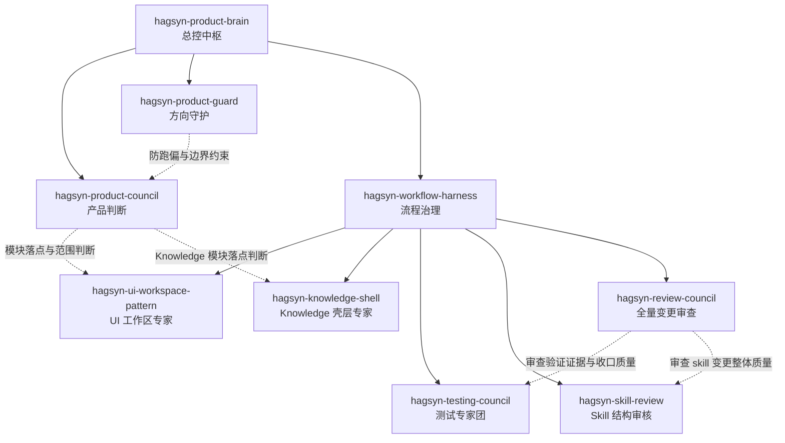

# Project Skill Index

## 1. 目的

本索引用于统一说明 Hagsyn-Graph 项目内专家团的组织架构、职责定位、触发场景和协作关系，避免后续只靠会话临时约定判断“该叫谁出手”。

项目内 skill 目录：

- `.agents/skills/**`

本文是长期协作规范文档，面向人类阅读与长期维护，不替代各 skill 自身的 `SKILL.md`。

## 2. 当前名册

当前仓库已落地：

- `hagsyn-product-brain`
- `hagsyn-product-council`
- `hagsyn-product-guard`
- `hagsyn-workflow-harness`
- `hagsyn-ui-workspace-pattern`
- `hagsyn-knowledge-shell`
- `hagsyn-testing-council`
- `hagsyn-review-council`
- `hagsyn-skill-review`

## 3. 组织树

上半部分按组织关系来理解：谁负责总控，谁负责判断，谁负责流程，谁负责专项与审查。

## 4. 职责分层说明

下半部分按职责层级说明每个专家团在组织中的定位。

### 4.1 总控层

#### `hagsyn-product-brain`

定位：
项目内任务的总控中枢。

主要职责：

- 识别任务类型
- 决定优先读取哪些长期文档
- 决定是否路由到下层专家团
- 控制执行顺序、stop hook 和整体收口节奏

不负责：

- 代替专项专家给出专业判断
- 代替 workflow 定义详细执行 SOP

### 4.2 判断与守护层

#### `hagsyn-product-council`

定位：
高层产品判断顾问团。

主要职责：

- 判断需求该不该做
- 判断能力应落在哪个模块
- 比较多个实现方向的产品合理性
- 判断当前阶段先做到什么程度

不负责：

- 直接承担实现工作
- 代替局部技术实现决策

#### `hagsyn-product-guard`

定位：
产品方向守门员。

主要职责：

- 防止项目重新滑回 demo 驱动
- 防止假数据、假图谱、展示型壳子替代真实工具价值
- 防止 `Knowledge` 在缺少真实场景时过早膨胀
- 守住 `Tools` 与 `Knowledge` 的边界

不负责：

- 独立控制完整 workflow
- 处理局部实现细节

### 4.3 执行治理层

#### `hagsyn-workflow-harness`

定位：
项目内常规开发事项的流程治理器。

主要职责：

- 为 feature、bugfix、UI 调整、skill 变更提供统一 workflow
- 约束实现、验证、报告和收口的顺序
- 在执行过程中决定何时应调起下层专项专家

不负责：

- 代替产品判断层做高层取舍
- 代替专项专家直接给结论

### 4.4 专项专家与审查层

#### `hagsyn-ui-workspace-pattern`

定位：
前端工作区与工具页面模式专家。

主要职责：

- 约束 `frontend/index.html` 的工作台外壳
- 约束工具流程、右侧详情区、空状态与结果区域
- 保持 UI 不漂向营销页或装饰性 dashboard

不负责：

- 后端、鉴权、数据库等无前端工作区影响的改动

#### `hagsyn-knowledge-shell`

定位：
`Nodes / Graph / Roadmaps` 的 Knowledge 壳层专家。

主要职责：

- 保持 Knowledge 模块 shell-first
- 防止用假内容营造“看起来很完整”
- 只在真实场景与真实内容源成熟后允许进一步展开

不负责：

- 工具执行链路本身的实现
- 全局产品路线取舍

#### `hagsyn-testing-council`

定位：
测试与回归覆盖专家团。

主要职责：

- 为功能改动定义应有的测试覆盖
- 为 bugfix 要求回归验证
- 为用户可见变化要求结构或交互验证
- 推动测试报告沉淀

不负责：

- 代替最终全量变更审查给交付结论

#### `hagsyn-skill-review`

定位：
项目内 skill 结构审核专家。

主要职责：

- 审核 `.agents/skills/**` 是否符合渐进式加载
- 审核 SOP 是否按场景拆分
- 审核脚本位置、语言和接口风格是否合规

不负责：

- 对整次任务的整体质量给最终结论

#### `hagsyn-review-council`

定位：
全量变更审查专家团。

主要职责：

- 在任务收口前对代码、文档、skill、配置和验证证据做统一审查
- 默认作为最终关口出手
- 只在高风险任务中做轻量预审，避免频繁打断主流程
- 输出问题、风险、缺失验证和是否可收口的结论

不负责：

- 取代 `hagsyn-testing-council` 做细化测试设计
- 取代 `hagsyn-skill-review` 做 skill 结构规范审核

## 5. Agent 速查表

这一表更适合 agent 或维护者快速查阅。

| Skill | 层级 | 核心定位 | 典型出手时机 | 主要输出 | 不负责什么 |
| --- | --- | --- | --- | --- | --- |
| `hagsyn-product-brain` | 总控层 | 统一路由与执行顺序控制 | 多步骤产品开发任务开始时 | 路由判断、阅读顺序、执行节奏 | 具体专项判断 |
| `hagsyn-product-council` | 判断层 | 产品判断顾问团 | 新需求、模块落点、方案取舍前 | 产品判断结论、边界、阶段建议 | 代码实现 |
| `hagsyn-product-guard` | 守护层 | 防跑偏守门员 | 页面扩张、模块扩张、Tools/Knowledge 边界摇摆时 | 风险约束、收缩建议 | 执行 workflow |
| `hagsyn-workflow-harness` | 治理层 | 常规事项流程治理器 | feature、bugfix、UI、skill 变更执行时 | workflow 路径、验证与收口顺序 | 高层产品取舍 |
| `hagsyn-ui-workspace-pattern` | 专项层 | UI 工作区专家 | `frontend/index.html`、工具工作区、右栏、空状态变化时 | UI 约束、结构建议 | 后端纯实现 |
| `hagsyn-knowledge-shell` | 专项层 | Knowledge 壳层专家 | `Nodes / Graph / Roadmaps` 相关变更时 | shell-first 约束、模块边界 | Tools 实现细节 |
| `hagsyn-testing-council` | 审查层 | 测试与回归专家 | 功能完成、语义变更、bugfix 收口前 | 测试建议、回归要求、测试报告要求 | 全量代码审查结论 |
| `hagsyn-skill-review` | 审查层 | skill 结构审核专家 | 新增或修改 `.agents/skills/**` 后 | skill 合规审查结果 | 一次任务的整体质量结论 |
| `hagsyn-review-council` | 审查层 | 全量变更审查专家团 | 默认任务完成后，高风险任务中途可轻量介入 | 问题清单、风险、缺失验证、是否可收口 | 细化测试设计或 skill 结构规范细查 |

## 6. 默认协作关系

建议默认按下面关系协作：

1. `hagsyn-product-brain` 判断总路径
2. `hagsyn-workflow-harness` 选择执行 workflow
3. 需要时调用：
   - `hagsyn-product-council`
   - `hagsyn-product-guard`
   - `hagsyn-ui-workspace-pattern`
   - `hagsyn-knowledge-shell`
   - `hagsyn-testing-council`
4. 若改动涉及项目内 skill，调用 `hagsyn-skill-review`
5. 在任务收口前默认调用 `hagsyn-review-council`

## 7. 默认出手原则

1. 该做产品判断时，先叫 `council / guard`，不要直接靠实现猜。
2. 该做流程治理时，先走 `workflow-harness`，不要临场拼流程。
3. 该做测试策略时，先叫 `testing-council`，不要把测试收口留成口头约定。
4. 该做 skill 审核时，先叫 `skill-review`，不要写完就算完成。
5. 该做交付前全量审查时，先叫 `review-council`，不要只凭“测试过了”就宣称任务完成。

## 8. 维护规则

后续新增项目内 skill、废弃 skill、或调整 skill 层级关系时，必须同步更新：

1. 本文
2. `docs/INDEX.md`
3. 受影响 skill 的 `SKILL.md` 路由说明

如果只改了 skill 本体但不改组织文档，视为治理信息未完成同步。
